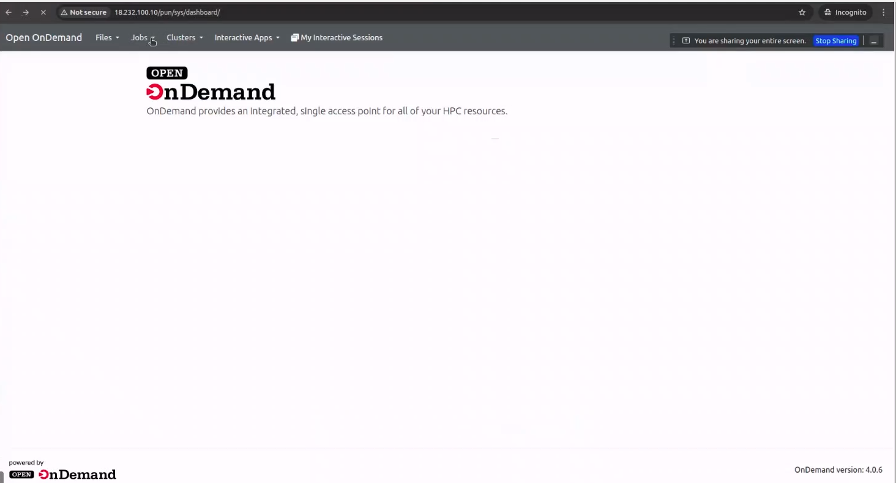

# Open OnDemand Installation Guide with integration with slurm

## Overview

Open OnDemand (OOD) is a web-based portal for accessing high-performance computing (HPC) resources. This guide provides step-by-step instructions for installing Open OnDemand on supported systems.

## Summary of important decisions / compatibility

- Tested OS: Rocky Linux 9.2 (RHEL 9 compatible).

- Open OnDemand version: follow the official 4.x repo for RHEL9/EL9.

- Required software modules (EL9): ruby:3.3 and nodejs:20 are what OOD's installation docs recommend enabling for EL9. However, release notes show earlier OOD releases required Ruby 3.1/Node 18; always check the specific OOD release you plan to install. (If you are installing a packaged release from the OOD repo, use the versions that the repo requires.)


### User Account Requirements

> **Note**: This tutorial assumes you are running commands from the root user.

## Installation Steps

### Step 1: Enable Dependencies

First, enable the necessary repositories and package modules:

```bash
# Enable CRB (CodeReady Builder) repository needed for some development libraries on RHEL9 family
dnf config-manager --set-enabled crb

# Install EPEL (Extra Packages for Enterprise Linux) recommended by the OOD install docs for EL9
dnf install epel-release

# Enable required software modules
dnf module enable ruby:3.3 nodejs:20
```

### Step 2: Add Repository and Install Open OnDemand

Add the Open OnDemand repository and install the package:

```bash
# Add Open OnDemand repository
dnf install https://yum.osc.edu/ondemand/4.0/ondemand-release-web-4.0-1.el9.noarch.rpm

# Install Open OnDemand
dnf install ondemand
```

### Step 3: Start Services

Start and enable the Apache HTTP Server:

```bash
# Start Apache HTTP Server
systemctl start httpd

# Enable Apache to start automatically on boot
systemctl enable httpd
```

### Step 4: Verify Installation

After installation, verify that Open OnDemand is working correctly:

1. Open a web browser and navigate to your server's IP address.
2. You should see a public page indicating that Open OnDemand is installed
3. The page will direct you to configure authentication before proceeding

> **Important**: The installation will not be functional until authentication is configured. Open OnDemand requires proper authentication setup to operate securely.

## Next Steps

### Create Test User

First, create a test user for authentication:

```bash
# Create a new user named 'test'
useradd test

# Set a password for the test user
passwd test
```

When prompted, enter and confirm a secure password for the test user.

### Configure Basic Authentication

Configure Open OnDemand to use basic authentication with the test user:

1. **Create authentication configuration file:**

```bash
# Create the authentication configuration directory if it doesn't exist
mkdir -p /etc/ood/config

# Create the authentication configuration file
tee /etc/ood/config/ood_portal.yml > /dev/null << 'EOF'
# Basic configuration for Open OnDemand portal
servername: localhost
port: 80

# Authentication configuration
auth:
  - 'AuthType Basic'
  - 'AuthName "Open OnDemand"'
  - 'AuthUserFile /etc/ood/config/.htpasswd'
  - 'Require valid-user'

# User map for the test user
user_map_cmd: '/opt/ood/ood_auth_map/bin/ood_auth_map.regex'

# Session configuration
lua_root: '/opt/ood/mod_ood_proxy/lib'
lua_log_level: 'info'
EOF
```

2. **Create password file for Apache authentication:**

```bash
# Create the htpasswd file for the test user
htpasswd -c /etc/ood/config/.htpasswd test
```

When prompted, enter the same password you set for the test user.

3. **Generate Apache configuration:**

```bash
# Generate the Apache configuration from the portal configuration
/opt/ood/ood-portal-generator/sbin/update_ood_portal
```

4. **Restart Apache to apply changes:**

```bash
# Restart Apache HTTP Server
systemctl restart httpd
```

### Test Authentication

1. Open a web browser and navigate to your server (e.g., `http://your-server-ip`)
2. You should be prompted for authentication
3. Enter the credentials:
   - **Username:** test
   - **Password:** (the password you set for the test user)
4. Upon successful authentication, you should see the Open OnDemand dashboard

*The Open OnDemand main dashboard showing the integrated access point for HPC resources*




### Configure Job Simple Templates and User Permissions For Testing

After successful authentication, you need to set up job templates and proper user permissions:

```bash
# Create job templates directory structure
mkdir -p /etc/ood/config/apps/myjobs/templates/default

# Copy default job templates
cp /var/www/ood/apps/sys/myjobs/example_templates/default/* /etc/ood/config/apps/myjobs/templates/default/

# Set proper permissions for the test user's home directory
chmod 755 /home/test/

# Restart Apache to apply changes
systemctl restart httpd
```

**Why these steps are necessary:**

- **Job Templates**: Open OnDemand requires job templates to be available for users to create and submit jobs. The templates provide pre-configured job scripts that users can customize.
- **Home Directory Permissions**: The web server needs read access to user home directories to display files and allow job submission. Setting permissions to 755 allows the web server to access the directory while maintaining security.
- **Apache Restart**: Required to reload the configuration and make the new templates available in the web interface.

After these steps, you should be able to access the Jobs section and see job templates available:

*Job Composer showing available simple templates and job management interface just for testing*

                                     

### Configure Slurm Cluster Integration

To enable job submission to a Slurm cluster, you need to configure the cluster connection settings:
Add cluster config for OOD — /etc/ood/config/clusters.d/<clustername>.yml
```bash
# Create the clusters configuration directory
sudo mkdir -p /etc/ood/config/clusters.d/

# Create Slurm cluster configuration
sudo vi /etc/ood/config/clusters.d/slurm.yml
```

Add the following configuration to the file:

```yaml
---
v2:
  metadata:
    title: "Slurm"
  login:
    host: "node-ip"
  job:
    adapter: "slurm"
    cluster: "cluster"
    bin: "/slurm-24/slurm-24.11.5/bin"     
    conf: "/slurm-24/slurm-24.11.5/etc/slurm.conf"      
    # bin_overrides:
    #   sbatch: "/usr/local/bin/sbatch"
    #   squeue: "/usr/local/bin/squeue"
    #   scontrol: "/usr/local/bin/scontrol"
    #   scancel: "/usr/local/bin/scancel"
    copy_environment: false
```

**Configuration Parameters Explained:**

- **title**: Display name for the cluster in the Open OnDemand interface
- **login.host**: IP address or hostname of the login/head node where jobs are submitted
- **job.adapter**: Specifies the workload manager type (slurm, pbs, torque, etc.)
- **job.cluster**: Name of the Slurm cluster as defined in slurm.conf
- **job.bin**: Path to Slurm binary executables directory
- **job.conf**: Path to the Slurm configuration file
- **bin_overrides**: Optional custom paths for specific Slurm commands (commented out in example)
- **copy_environment**: Whether to copy the user's environment variables to submitted jobs

**Important Notes:**

> **Configuration**: Replace `"node-ip"` with the actual IP address or hostname of your Slurm head node.

> **Paths**: Verify that the paths `/slurm-24/slurm-24.11.5/bin` and `/slurm-24/slurm-24.11.5/etc/slurm.conf` exist and are correct for your Slurm installation.

After creating the cluster configuration, restart Apache to load the new settings:

```bash
# Restart Apache to apply cluster configuration
sudo systemctl restart httpd
```

The Slurm cluster should now appear in the "Clusters" dropdown menu in the Open OnDemand interface, and users will be able to submit jobs to the configured cluster.

### Verify Service Status

You can check the status of required services using:

```bash
# Check Apache status
sudo systemctl status httpd

# Check if Open OnDemand is responding
curl -I http://localhost
```

### Troubleshooting

If you encounter issues:

1. Check Apache error logs: `sudo journalctl -u httpd`
2. Verify all dependencies are installed correctly
3. Ensure firewall ports are open (typically port 80 and 443)
4. Check SELinux settings if applicable


**Issuses We Faced When Not Using SSL**
### Fix Session Store Configuration (Important)

If you are not using ssl you will encounter issues with job submission issue, you need to configure the session store settings. This is a common issue when Open OnDemand is not running over HTTPS.

**Problem**: Job submission may fail or sessions may not persist properly due to HTTP 422 Error / InvalidAuthenticityToken.

  

**Solution**: Configure session stores to work with HTTP (non-secure) connections.
**OOD has multiple Rails apps running**

- dashboard → the main OOD interface
- myjobs → the job composer app

1. **Modify MyJobs app inside /var/www/ood (system-installed app)**

```bash

# This is where the system-wide job composer app lives.
# We change this so session cookies are allowed over HTTP.
vi /var/www/ood/apps/sys/myjobs/config/initializers/session_store.rb
# And Add Force Rails to store session cookies over HTTP (no SSL)
Rails.application.config.session_store :cookie_store, key: '_job_constructor_session', secure: false

```

2. **Modify the *config override locations* for MyJobs:**

```bash

# Create the myjobs initializers directory
sudo mkdir -p /etc/ood/config/apps/myjobs/initializers/

# These override the system defaults in /var/www and are loaded first if present.
# Make sure both possible paths exist and have the override.
vi /etc/ood/config/apps/my_jobs/config/initializers/session_store.rb
vi /etc/ood/config/apps/my_jobs/initializers/session_store.rb

# And Add MyJobs session cookie settings for HTTP (no SSL)
Rails.application.config.session_store :cookie_store, key: '_myjobs_session', secure: false

```

3. **Add an override initializer for MyJobs**

```bash

# This is a "force override" file that some deployments use to replace upstream settings.
vi /etc/ood/config/apps/my_jobs/config/initializers/session_store_override.rb
#And Add
Rails.application.config.session_store :cookie_store, key: '_myjobs_session', secure: false

```

4. **Modify Dashboard app session settings**

```bash

# Create the dashboard initializers directory
sudo mkdir -p /etc/ood/config/apps/dashboard/initializers/

# The dashboard app is separate and also needs HTTP-compatible cookies.
vi /etc/ood/config/apps/dashboard/config/initializers/session_store.rb
vi /etc/ood/config/apps/dashboards/initializers/session_store.rb
# And Addd Dashboard session cookie settings for HTTP (no SSL)
Rails.application.config.session_store :cookie_store, key: '_dashboard_session', secure: false

```

5. **Restart services to apply the changes:**

```bash
# Generate the Apache configuration from the portal configuration
/opt/ood/ood-portal-generator/sbin/update_ood_portal
```

```bash
# Restart Apache HTTP Server
systemctl restart httpd

# If you have the Open OnDemand portal service, restart it as well
systemctl restart ondemand-portal 2>/dev/null || true
```

**Why this fix is needed:**

- By default, Rails applications set `secure: true` for cookies, which requires HTTPS
- In development or HTTP-only environments, this prevents proper session handling
- Setting `secure: false` allows cookies to work over HTTP connections
- This is a known issue documented in [GitHub Issue #1193](https://github.com/OSC/ondemand/issues/1193)

> **Security Note**: This configuration is suitable for development and testing environments. For production deployments, consider setting up HTTPS and using secure cookies.

**The Open OnDemand main dashboard showing the integrated access point for HPC resources**


**More details about the submitted job**
 


#Then do

```bash

su - test
squeue -u test  # Should show the submitted job
```


## Additional Resources

- [Official Open OnDemand Documentation](https://osc.github.io/ood-documentation/latest/installation/install-software.html)

